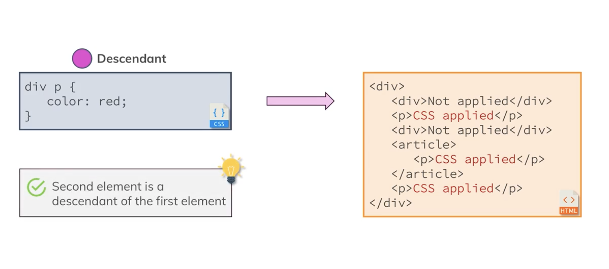

# CSS Course by Talos

## Selectors


---
## Cascading style sheets & Specify


---
## Combinators




---
## Selectors, properties, values


---
## Box model / Layers


---
## Margin Collapsing
When working with margins, you can get unexpected results. 

* Why are two adjacent elements sharing one margin even though each element has its own one?
* Why does a parent element (e.g. ```<section>```  as in the videos) suddenly take on the margin of the child element (e.g. ```<h1>``` )?

It's always related to margin collapsing. You can dive deeply into it with the help of the following awesome article: https://developer.mozilla.org/en-US/docs/Web/CSS/CSS_Box_Model/Mastering_margin_collapsing

There, three base cases are described:

1. Adjacent siblings which both have margins
2. A parent which holds one or more child elements where the first and/ or last (or the only) child has margins
3. An element without content, padding, border and height

Let's explore these cases:

1. Adjacent Siblings

    In this case, the first element might have a margin of 10px  (on all sides let's say) and the second one has 5px  (or 20px  - the values don't matter).

    CSS will collapse the margins and only add the bigger one between the elements. So if we got margins of 10px  and 5px , a 10px  margin would be added between the elements?

2. A parent with children that have a margin

    To be precise, the first and/ or last or the only child has to have margins (top and/ or bottom). In that case, the parent elements margin will collapse with the child element(s)' margins. Again, the bigger margin wins and will be applied to the parent element.

    If the parent element has padding, inline content (other than the child elements) or a border, this behavior should not occur, the child margin will instead be added to the content of the wrapping parent element.

3. An empty element with margins

    This case probably doesn't occur that often but if you got an element with no content, no padding, no border and no height, then the top and bottom margin will be merged into one single margin. Again, the bigger one wins.

---
## Shorthand properties


---
## Display none vs visibility hidden
We had a look at display: none;  - this value removes the element to which you apply it from the document flow. This means that the element is not visible and it also doesn't "block its position". Other elements can (and will) take its place instead.

There is an alternative to that though.

If you only want to hide an element but you want to keep its place (i.e. other elements don't fill the empty spot), you can use visibility: hidden; 

Here's a visual example:
```css
    .box-1 {
        display: none;
    }

    .box-2 {
        display: inline-block;
    }
```
Will render:

x  

where x  has the class box-2 . The first element just isn't displayed. It's still part of the DOM though, you can still access it via JavaScript for example.

Here's an example for visibility: hidden :
```css
    box-1 {
        visibility: hidden;
    }

    .box-2 {
        display: inline-block;
    }
```

Will render:
where _  simply is an empty spot and x  has the class box-2 .

The element is only invisible, it's not removed from the document flow and of course also not from the DOM.

---
## HTML Refresher Block-Level vs inline elements
It's not really a CSS topic, though it's related to it: The difference between block-level and inline elements.

You can read a more detailed article (which also includes a YouTube video about HTML at the top of the page) here: https://academind.com/learn/html/beginner-s-guide/diving-deeper-into-html#block-level-vs-inline-elements

Here's the executive summary:

Block-level elements are rendered as a block and hence take up all the available horizontal space. You can set margin-top and margin-bottom and two block-level elements will render in two different lines.

Some examples are: ```<div> , <section> , <article> , <nav>  but also <h1> , <h2>  etc and <p> ```.

Inline elements on the other hand only take up the space they require to fit their content in. Hence two inline-elements will fit into the same line (as long as the combined content doesn't take up the entire space in which case a line break would be added).

They also use the box-model you learned about but margin-top  and margin-bottom  have no effect on the element. padding-top  and padding-bottom  also have a different effect. They don't push the adjacent content away but they will do so with the element border. You can read more about that behavior in the following article: https://hacks.mozilla.org/2015/03/understanding-inline-box-model/

Additionally, setting a width  or height  on an inline element also has no effect. The width and height is auto to take as much space as required by the content.

Logically, this makes sense since you don't want your inline elements to destroy your multi-line text-layout. If you want to do so or need both block-level and inline behavior, you can set display: inline-block  to merge behaviors.

Some example elements are: ```<a> , <span> ,  ```

___
## Pseudo clases & Pseudo elements


---
## Properties worth to remember


---
## Classes or ids


---
## Not using important


---
## Positioning Elements


Viewport: Simply is the visible part/ area of your web page. You could translate it with "your browser window".

---
## The background shorthand - Theory


---
## Using multiple background


---
## Filters
https://developer.mozilla.org/en-US/docs/Web/CSS/filter 

